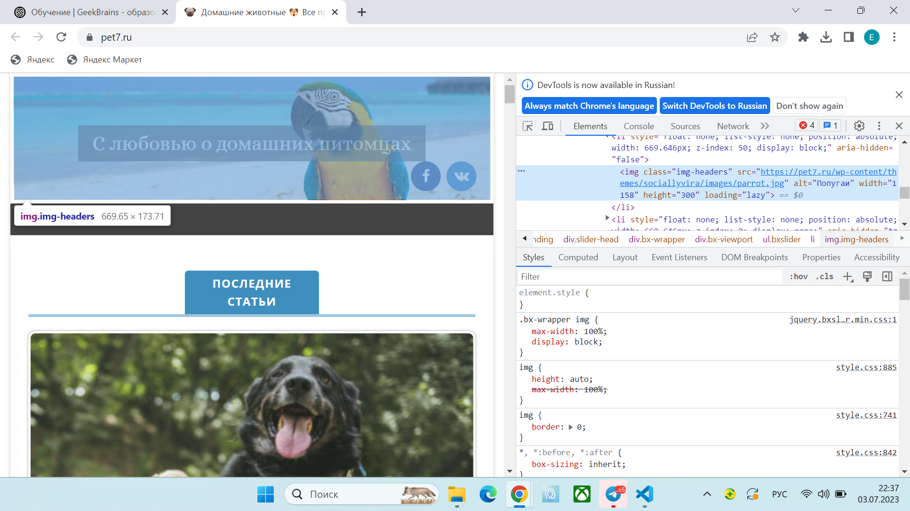
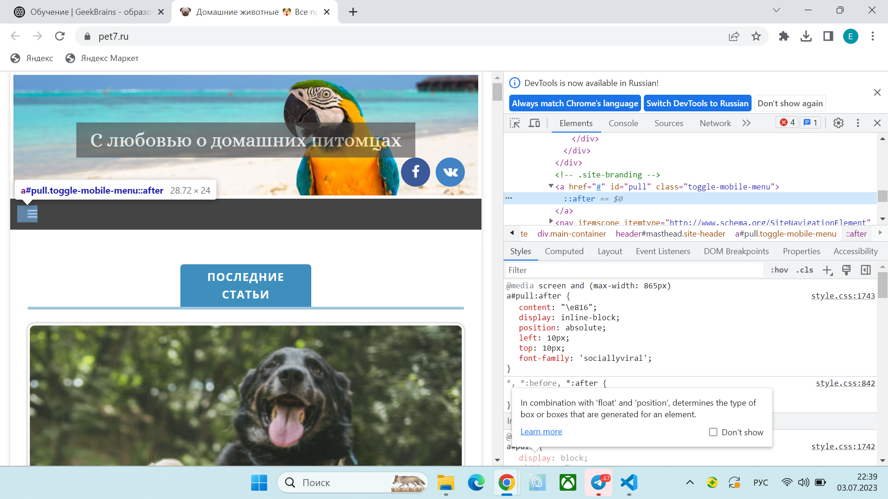
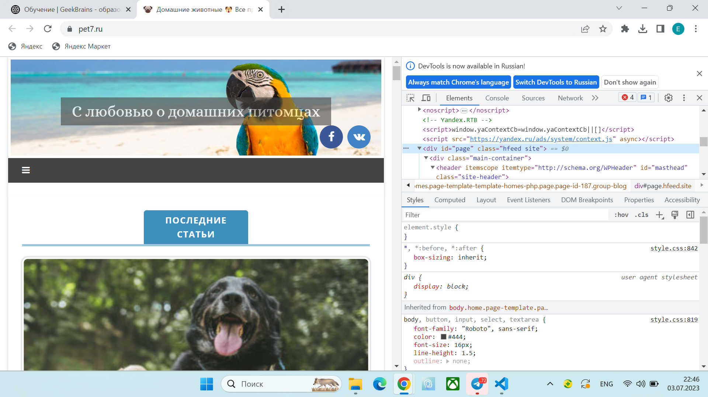
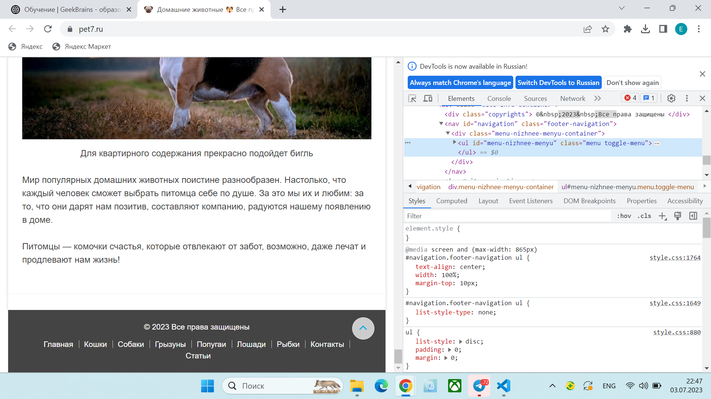
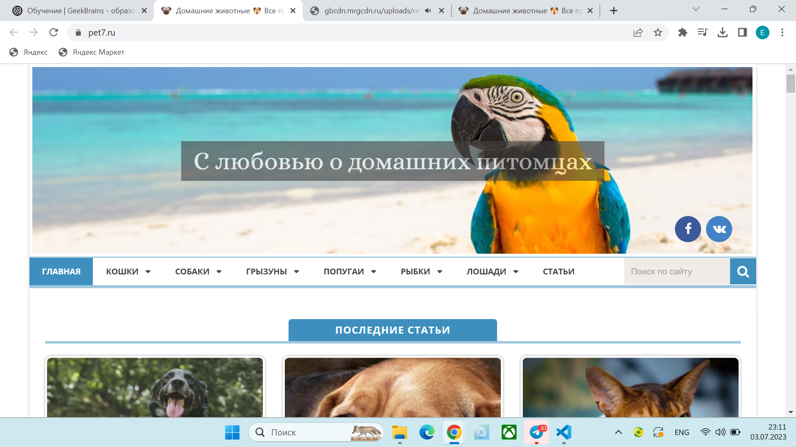
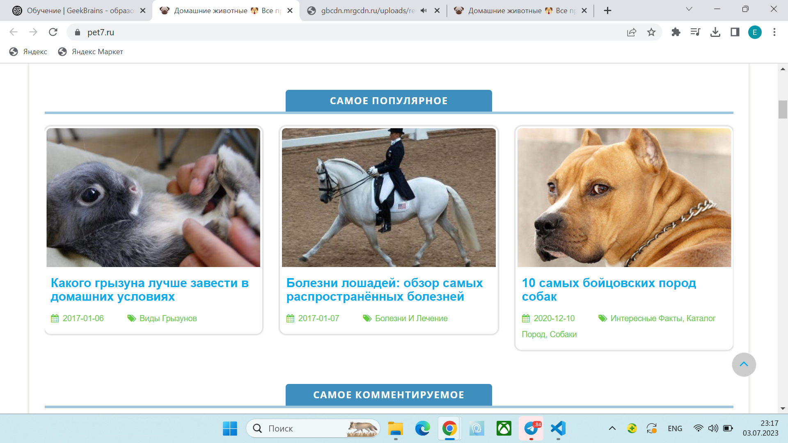
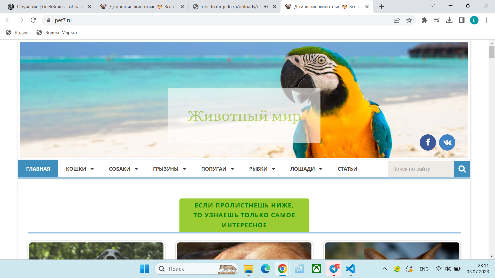
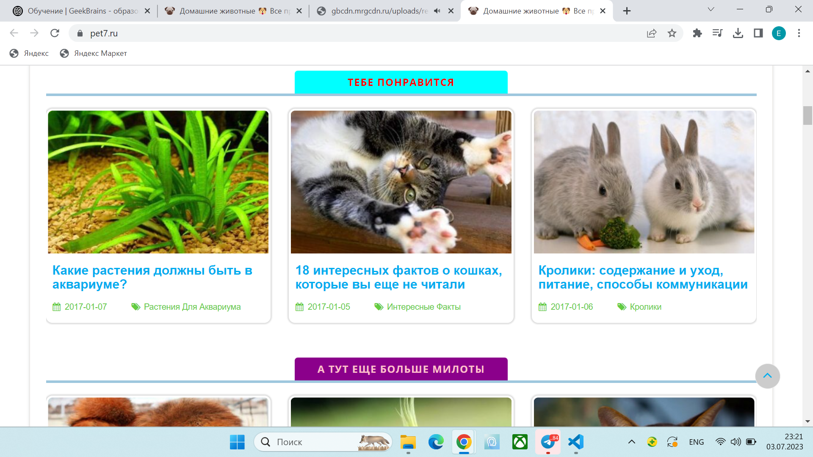
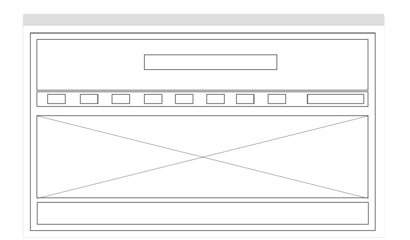

## Задача: на основе сайта https://pet7.ru/

1. Определите, на каком протоколе работает сайт.
```
Сайт работает на протоколе "https"
```
2. Проанализируйте структуру страницы сайта.

- Header

]

- Меню

]

- Content

]

- Footer

]


3. Внесите не менее 3 изменений на страницу с помощью инструмента разработчика и представьте скриншоты было/стало.
```
Было:
```
]
]

```
Стало:
```
]
]

4. Создайте прототип низкой детализации.
]

